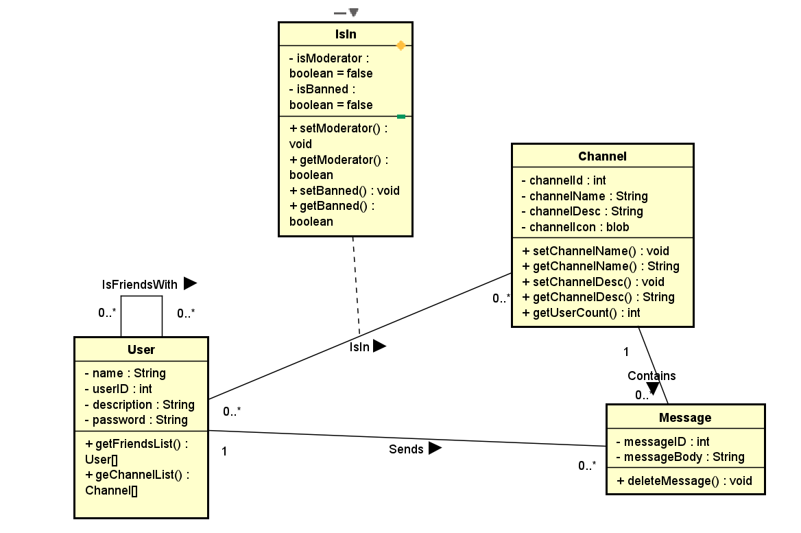

# MangoChat

## Description
MangoChat is a modern and user-friendly chat application designed to facilitate seamless communication and collaboration. With its intuitive interface and a range of features, MangoChat aims to provide users with an enjoyable and efficient chatting experience. Whether for casual conversations or professional communication, MangoChat aims to be a versatile and reliable solution for users seeking an enhanced chat experience.

Users of MangoChat will be able to create and join Lobbies. These Lobbies will contain Channels in which users can send messages that all other users in that Lobby can see. Users can also add other Users to a Friend List, and send messages directly to them. Users can leave Lobbies, and Lobbies can be deleted by Users marked as Admins.

## Requirements

### User Requirements 
User Requirements   
Allow users to log into account  
Allow new Users to Register for an account  
Allow Users to join & Leave Channels  
Allow users to Send messages to each other and within a channel  
Users can Add/remove friends     
Invite other users to Channels  
Users should be able to input personal info in their bio page  

Admin Requirements:  
Admins should be allowed to manage channels  
Admins should be able to remove members of channels  
Appoint other users to be admins of a channel  

### System Requirements 

Database containing all Channels, including message/channel history, connected users, banned users and admins.  
User can only view channels and friends when logged in  
Store channel ID's to invite other users to channel  
System should store user's personal information and not display it publically  
System should store a list of Admins and Regular users     
System should store ID’s of friends together  
System should Store ID’s of banned/blocked Users   
Hide Channels user is not in  

Non - Functional Requirements:

System should store User’s personal info  
Program should be developed mostly in Python   
Program should be developed utilizing Flask  
System should not disclose login information with other users  

## Class Diagram

